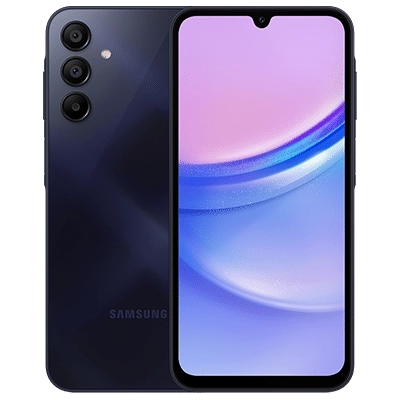

<h1 align="center">
  
</h1>
<p align="center">
  <a href="https://github.com/lyntaxqq/Nexusify/LICENSE"></a>
  
  <a href="https://github.com/lyntaxqq/Nexusify"></a>
  <a href="https://crowdin.com/project/Nexusify"></a>

<p align="center">
  <a href="https://xdaforums.com/t/module-a155f-a155m-project-nexusify.4769926/">🚀 Discussions</a>
  •
  <a href="https://xdaforums.com/t/module-a155f-a155m-project-nexusify.4769926/">💬 XDAForums</a>
</p>
  
</p>
<p align="center">Nexusify is a Magisk Module for making Samsung Galaxy better.</p>


# ℹ️ What is Nexusify?
Nexusify is a Magisk Module.

It removes all useless Samsung apps that runs on background and eats your RAM or even CPU. You can't see them because they are all hidden apps.

The goal is making this project bigger and smoother.  If you have any issues, use XDAForums link. Any pull request will be welcome.

The status of project can be found in below.

# 📱 The features of Nexusify
- Smoother experience
- Supports Galaxy A series.
- Removing useless Samsung apps
- S25 Wallpapers
- Galaxy AI Support
  - Audio eraser
  - Browsing assist
  - Call assist
  - Drawing assist
  - Interpreter
  - Note assist
  - Now brief
  - Photo assist
  - Semantic search
  - Transcript assist
  - Writing assist
- High-end Animations
- Live blur support
- S25 Sounds
- AOD Support
- Mini Dex Support
- Spoof GPU to Adreno 830
- Spoof CPU to Snapdragon 8 Elite
- Spoof device to S25 Ultra

# ⚠️ Accountability
```cpp
#include <std_disclaimer.h>

/*
* Your warranty is now void.
*
* I am not responsible for bricked devices, dead SD cards,
* thermonuclear war, or you getting fired because the alarm app failed. Please
* do some research if you have any concerns about doing this to your device
* YOU are choosing to make these modifications, and if
* you point the finger at me for messing up your device, I will laugh at you.
*
* I am also not responsible for you getting in trouble for using any of the
* features in this ROM, including but not limited to Call Recording, secure
* flag removal etc.
*/
```

# ✅ Status of project

| Symbol | Meaning      |
|:------:|:------------:|
| ✅     | Working good |
| ⚠️     | Problematic |
| ❌     | Not Working |
| ❔     |  Not Tested  |

<details>
<summary><b><strong>MediaTek Devices</strong></b></summary>

## Samsung Galaxy A15



**Status: Active** <br>
**Codename: a15** <br>
**Contributors: [lyntaxqq](https://github.com/lyntaxqq/).**

### Status

| Feature            | Description    | State |
|:-------------------|:---------------|:-----:|
| Booting            |                | ✅    |
| Galaxy AI          |                | ✅    |
| Camera             |                | ✅    |
| Spoof CPU          |                | ✅    |
| Spoof GPU          |                | ✅    |
| Live Blur          |                | ✅    |
| Always-on-Display  |                | ✅    |
| AI Wallpapers      |                | ✅    |

## Samsung Galaxy A07


**Status: Work-in progress** <br>
**Codename: a07** <br>
**Contributors: [lyntaxqq](https://github.com/lyntaxqq/).**

### Status

| Feature            | Description    | State |
|:-------------------|:---------------|:-----:|
| Booting            |                | ❔    |
| Galaxy AI          |                | ❌    |
| Camera             |                | ❌    |
| Spoof CPU          |                | ❌    |
| Spoof GPU          |                | ❌    |
| Live Blur          |                | ❌    |
| Always-on-Display  |                | ❌    |
| AI Wallpapers      |                | ❌    |

</details>

# ❤️ Contributors
Note14ProUser for testing on A07 and reporting status.
closeronget3 for testing on A15 4G and reporting status.
